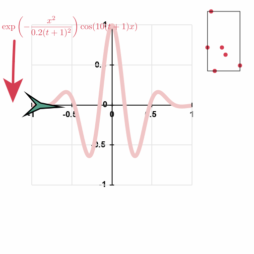

# 2danimator
Quick'n Dirty software to create 2d animations in wysiwyg.

## Features
- Polygones shapes
- BSplines and polylines
- Latex
- plotting functions
- loading 2d and 3d pointsets
- all parameters are keyable

## Usage
- click buttons to add objects
- press 's' to keyframe all properties of an object at once. All properties are keyables (color, line thickness, if there is an arrow or not etc.), and interpolation is mostly done linearly for real variables and to the previous keyframe for integer/enum/text variables.
- drag'n drop a bspline/polyline/function plot onto any position/angle parameter to link an object position/orientation to the curve/function graph.
- in the latex object, use shift+enter to skip lines and enter to compile the tex string.

## Install:
### Windows:
- Install Latex (if you want to include latex stuffs/equations)
- Install dvisgm (if you want to include latex stuffs/equations) here: https://dvisvgm.de/Downloads/
Both latex and dvisgm should be working from the **command prompt** (i.e., not Powershell). If dvisgm is working in the powershell but says *MiKTeX session could not be initialized* in the command prompt, type the 4 lines in their FAQ ( https://dvisvgm.de/FAQ/ ) in the command prompt and it should work.
- Compile wxWidgets
- it also depends on Cairo and Freetypes-2.11.0, but compiled libraries are shipped with 2danimator. Depends on a modified version of nanosvg, but header only and shipped.
- Open the VisualStudio .sln solution, edit the path to wxWidgets, Compile.

### Linux:
- coming soon. Should be easy.

